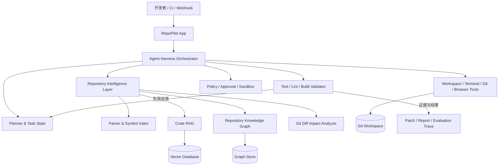

# RepoPilot-Harness

> 面向代码仓库维护的软件工程 Agent 平台

RepoPilot-Harness 基于 OpenHands Agent Harness 进行二次开发，目标是让 LLM Agent 不只能够“阅读文件并执行命令”，还能够持续理解一个代码仓库的结构、语义、依赖关系和变更影响，在可追踪、可验证的执行闭环中完成代码维护任务。

本仓库 `RepoPilot-App` 是 RepoPilot-Harness 的应用与交互层代码库。目前保留了较多 OpenHands Agent Canvas 的基础设施，包括多后端管理、Agent 对话、终端与文件交互、Git 操作、自动化任务、本地开发栈和测试框架。Repository Intelligence、Code RAG、Repository Knowledge Graph 与 Evaluation Harness 是 RepoPilot 二次开发的核心演进方向；下文描述的是产品目标架构，具体能力以当前代码和版本说明为准。

## 项目目标

RepoPilot-Harness 聚焦真实代码仓库中的长期维护工作：

- 建立可增量更新的仓库认知，而不是在每次任务中从零扫描代码。
- 将符号、语义、依赖关系、Git 历史和测试信息统一为可检索的工程上下文。
- 让 Agent 能够完成问题定位、影响分析、修改实施、测试验证和失败修正。
- 记录每一步输入、检索结果、工具调用、代码变更和验证证据，支持审计与复现。
- 通过统一的 Evaluation Harness 衡量任务成功率、修改质量、成本、时延和回归风险。

RepoPilot-Harness 适用于缺陷修复、代码理解、重构、依赖升级、测试补全、代码审查、仓库问答和持续维护自动化等场景。

## Agent Harness 架构



架构按职责分为六个层次：

1. **交互与接入层**：提供 Web UI、会话、任务状态、文件浏览、终端、Git 视图以及自动化入口。
2. **Agent Harness 层**：管理任务规划、上下文、模型调用、工具调度、检查点、恢复和多轮执行状态。
3. **Repository Intelligence Layer**：把仓库内容转换成符号索引、向量索引、关系图谱和变更影响信息。
4. **执行与隔离层**：在受控工作区内读写文件、运行命令、调用 Git，并可通过 Docker 或远程 Agent Server 隔离执行。
5. **验证层**：运行单元测试、静态检查、构建和项目自定义验证命令，将失败结果反馈给 Agent。
6. **评测与可观测层**：保存轨迹、补丁、检索命中、工具结果、资源消耗和最终评分。

## Repository Intelligence Layer

Repository Intelligence Layer 是 RepoPilot-Harness 区别于通用聊天式编码助手的核心。它负责把原始仓库转化为 Agent 可消费、可更新、可引用的工程知识。

典型处理流程包括：

1. 发现仓库语言、构建系统、包结构、入口、测试目录和工程约定。
2. 解析 AST、符号定义与引用，提取类、函数、方法、接口、类型、模块和配置项。
3. 建立文件、符号、依赖、调用、继承、测试覆盖和 Git 变更之间的关系。
4. 对代码、文档、配置和提交信息进行切分、摘要与向量化。
5. 根据文件变化增量更新索引，避免每次任务重新处理整个仓库。
6. 为检索结果保留文件路径、行号、提交版本和解析器版本等来源信息。

该层向 Agent 提供统一查询接口，使规划器无需了解底层索引或存储实现，即可请求“某个符号的定义与调用方”“与报错语义最相关的代码”“本次 Diff 可能影响的测试”等上下文。

## Code RAG 与 Repository Knowledge Graph

RepoPilot 使用 Code RAG 和 Repository Knowledge Graph 组合仓库的语义信息与结构信息。

### Code RAG

Code RAG 面向自然语言需求、错误日志和不完整线索进行语义召回。与普通文档 RAG 相比，代码切分需要尊重语言结构，优先以函数、类、模块和配置块为边界，并在索引中保留：

- 符号限定名、文件路径、语言和代码范围。
- 所属模块、导入依赖和相邻上下文。
- 文档注释、测试名称、错误信息与相关提交。
- 内容哈希和 Git revision，用于增量更新与结果复现。

向量数据库用于保存代码与工程文档的 embedding。存储层应保持可插拔，可按部署规模接入本地向量索引或 Qdrant、Milvus、pgvector 等服务。

### Repository Knowledge Graph

知识图谱保存无法仅靠向量相似度稳定表达的代码关系。典型节点包括 Repository、Package、Module、File、Symbol、Test、Commit 和 Issue；典型边包括：

- `DEFINES`、`REFERENCES`、`IMPORTS`
- `CALLS`、`IMPLEMENTS`、`EXTENDS`
- `TESTS`、`CONFIGURES`、`GENERATES`
- `CHANGED_IN`、`DEPENDS_ON`、`OWNED_BY`

图谱既可用于解释“为什么召回这段代码”，也可从一个高置信度种子节点向调用方、被调用方、实现类、配置项和相关测试扩展上下文。

## 混合检索：符号、向量与代码关系扩展

RepoPilot-Harness 的目标检索链路不是单一搜索，而是多阶段混合检索：

1. **查询理解**：从用户需求、堆栈、日志或 Diff 中提取文件名、符号名、错误码和领域概念。
2. **符号检索**：优先执行精确名称、限定名、定义与引用查询，快速锁定高精度候选。
3. **向量检索**：根据意图和语义召回命名不同但职责相近的代码、测试和文档。
4. **关系扩展**：沿调用、依赖、继承、测试和 Git 关系对候选进行有限深度扩展。
5. **重排与去重**：综合符号匹配、向量相似度、图距离、文件新鲜度和任务相关性排序。
6. **上下文装配**：在模型 token 预算内生成带路径、行号和关系说明的上下文包。

这种方式兼顾精确性与召回率，并减少把整个仓库直接塞入模型上下文所带来的成本和噪声。

## Git Diff 影响分析

Git Diff 是仓库维护任务的重要边界。RepoPilot-Harness 计划将文本差异转换为符号级和关系级变更，并回答：

- 哪些文件、函数、类型、接口或配置发生了变化？
- 修改是否改变公开 API、数据结构、控制流或依赖边？
- 哪些调用方、实现类、下游模块和测试可能受到影响？
- 是否存在遗漏的测试、文档、迁移脚本或生成文件？
- 本次变更的风险范围与建议验证命令是什么？

影响分析的结果可用于代码审查、测试选择、回归风险提示，也可作为 Agent 制订修改计划和停止条件的依据。

## 自动修复与测试验证闭环

RepoPilot-Harness 将代码修改视为一个带证据的迭代过程：

```text
任务理解 → 仓库检索 → 修改计划 → 最小补丁 → 定向验证
                                      ↑          ↓
                                      └── 失败诊断与修正 ──┘
```

一次完整闭环通常包含：

1. 将需求与仓库约束转化为可验证的任务目标。
2. 检索相关符号、关系、历史变更和现有测试。
3. 生成范围受控的修改计划，并在工作区应用补丁。
4. 先运行受影响的快速测试，再运行 lint、类型检查、构建或更广泛的回归测试。
5. 解析失败输出，回到检索或修改阶段，并限制重试次数与修改范围。
6. 输出最终 Diff、验证命令、结果摘要、剩余风险和可复现轨迹。

Harness 不应把“代码已生成”等同于“任务已完成”。只有满足任务验收条件且关键验证通过，执行才进入完成状态；无法验证的部分需要在报告中明确标注。

## Agent Evaluation Harness

Evaluation Harness 用统一任务规范评估不同模型、提示词、检索策略和工具配置。一个评测样本可包含固定仓库版本、问题描述、允许的工具、资源预算、隐藏测试和期望产物。

建议记录以下指标：

| 维度       | 示例指标                                            |
| ---------- | --------------------------------------------------- |
| 任务结果   | 测试通过率、问题解决率、补丁可应用率                |
| 修改质量   | 正确性、最小修改程度、回归数量、静态检查结果        |
| 检索质量   | Recall@K、MRR、关键符号覆盖率、无关上下文比例       |
| 执行效率   | 总时长、LLM 调用次数、token、工具调用次数、重试次数 |
| 安全与合规 | 越权操作、敏感信息暴露、未授权网络或文件访问        |
| 可复现性   | 仓库 revision、环境镜像、配置、随机种子和完整轨迹   |

评测既支持离线 benchmark，也应支持对真实维护任务进行回放和回归比较，防止模型或检索策略升级后出现隐性退化。

## 技术栈

| 领域       | 技术与用途                                                                      |
| ---------- | ------------------------------------------------------------------------------- |
| 应用前端   | React 19、TypeScript、React Router、Vite、Tailwind CSS、Zustand、TanStack Query |
| Agent 基座 | LLM Agent、OpenHands Agent Harness、OpenHands Agent Server、ACP 兼容 Agent      |
| 智能服务   | Python，用于仓库解析、索引、RAG、知识图谱、评测与后台任务扩展                   |
| 检索       | Code RAG、Embedding、符号索引、全文检索、混合重排                               |
| 数据层     | Vector Database、Repository Knowledge Graph、任务与轨迹存储                     |
| 工程工具   | Git、终端、文件系统、语言服务、测试/构建工具链                                  |
| 运行与隔离 | Docker、远程 Agent Server、本地受控工作区                                       |
| 质量保障   | Vitest、Testing Library、Playwright、Mock LLM E2E、Live E2E                     |

当前仓库的主要实现语言是 TypeScript；Python Agent Server 与后续智能服务通过本地启动器、服务 API 或容器集成。

## 仓库结构

```text
RepoPilot-App/
├── src/                  # React 应用、API 适配、组件、Hooks 与状态管理
├── bin/                  # 本地应用 CLI 入口
├── scripts/              # 开发栈、静态服务、Ingress 与构建脚本
├── tools/                # Agent 可调用的辅助工具
├── tests/e2e/            # Mock LLM 与真实后端端到端测试
├── __tests__/            # 单元测试和组件测试
├── docker/               # Docker 镜像与入口脚本
├── electron/             # 桌面应用运行时
├── docs/                 # 架构、开发、自托管与专题文档
├── examples/             # 集成示例
└── package.json          # 依赖、开发、构建与测试命令
```

随着 RepoPilot 能力落地，Repository Intelligence、索引服务、评测数据集和后端服务应保持清晰的模块边界，避免将解析、检索或模型编排逻辑耦合进 React 组件。

## 本地启动

### 环境要求

- Node.js `22.12.0` 或更高版本
- npm（仓库当前使用 npm 10）
- [`uv`](https://docs.astral.sh/uv/)，用于通过 `uvx` 启动 OpenHands Agent Server 和自动化服务
- Git
- 可选：Docker，用于隔离执行或镜像构建
- 至少一个可用的 LLM Provider 凭据，启动后可在界面中配置

> [!WARNING]
> 默认本地开发栈会在宿主机上运行 Agent Server。Agent 执行的命令可能访问当前用户可访问的文件和进程。只对可信仓库使用此模式；处理不可信代码时请使用 Docker 或远程隔离环境，并限制挂载目录与凭据。

### 从源码运行完整开发栈

```powershell
git clone <your-repository-url> RepoPilot-App
cd RepoPilot-App
Copy-Item .env.sample .env
npm install
npm run dev
```

启动完成后访问 [http://localhost:8000](http://localhost:8000)。`npm run dev` 会启动：

- OpenHands Agent Server
- Automation Backend
- Vite 开发服务器
- 统一 Ingress

`.env` 可按需调整，常用变量如下：

| 变量                         | 用途                               | 默认值             |
| ---------------------------- | ---------------------------------- | ------------------ |
| `VITE_FRONTEND_PORT`         | Vite 前端端口                      | `3001`             |
| `VITE_BACKEND_BASE_URL`      | 浏览器访问 Agent Server 的基础 URL | 当前页面 Origin    |
| `VITE_WORKING_DIR`           | 新会话使用的默认工作区             | 启动器管理的工作区 |
| `VITE_ENABLE_BROWSER_TOOLS`  | 是否为新会话启用浏览器工具         | `true`             |
| `VITE_BASE_PATH`             | SPA 部署子路径，例如 `/canvas`     | `/`                |
| `VITE_DO_NOT_TRACK`          | 设为 `1` 时禁用遥测                | 未设置             |
| `OH_AGENT_SERVER_LOCAL_PATH` | 使用本地 software-agent-sdk 源码   | 未设置             |
| `OH_AGENT_SERVER_GIT_REF`    | 指定 Agent Server Git 分支或提交   | 未设置             |
| `OH_AGENT_SERVER_VERSION`    | 指定 Agent Server PyPI 版本        | 最新兼容版本       |

请以 [`.env.sample`](./.env.sample) 中的注释为准，不要提交包含密钥的 `.env` 文件。

### 其他开发模式

```powershell
# 仅启动 Agent Server 与 Vite，不启动自动化服务
npm run dev:minimal

# 使用 MSW Mock API 开发前端
npm run dev:mock

# 前端连接到单独管理的后端
npm run dev:frontend

# 构建并启动静态版本
npm run build
npm run start

# 构建并运行 Electron 桌面端
npm run desktop
```

`dev:minimal` 默认通过 [http://localhost:3001](http://localhost:3001) 访问。更多启动器、Agent Server 版本覆盖和多后端说明参见 [开发指南](./docs/DEVELOPMENT.md)。

## 开发与验证

提交变更前建议至少运行与改动范围对应的检查：

```powershell
npm run lint
npm test
npm run build
npm run build:lib
```

端到端测试：

```powershell
# 使用脚本化 Mock LLM，要求本地具备对应运行依赖
npm run test:e2e:mock-llm

# 使用真实 LLM 与真实 Agent Server；先检查环境配置
npm run test:e2e:live -- --check
npm run test:e2e:live
```

真实 LLM E2E 会产生调用成本，并需要在 `.env` 中提供支持的 LLM 凭据。不要在日志、截图、提交内容或测试夹具中写入密钥。

## 设计原则

- **Repository-first**：决策以仓库事实、符号关系和可引用证据为基础。
- **Retrieval before generation**：先定位相关上下文，再生成计划或补丁。
- **Minimal and reversible changes**：优先小范围、可审查、可回滚的修改。
- **Verification-driven completion**：以测试和验收条件决定任务是否完成。
- **Human control**：高风险、破坏性或外部副作用操作需要明确授权。
- **Traceable execution**：检索、推理、工具调用、Diff 和验证结果均可追踪。
- **Pluggable infrastructure**：模型、向量库、图存储、执行后端和评测集可替换。

## 文档

- [文档索引](./docs/README.md)
- [现有应用架构](./docs/architecture.md)
- [开发指南](./docs/DEVELOPMENT.md)
- [自托管指南](./docs/SELF_HOSTING.md)
- [ACP Agent 集成](./docs/ACP_AGENTS.md)

## License

本项目沿用仓库中的 [MIT License](./LICENSE)。基于 OpenHands 的代码与第三方依赖同时受其各自许可证约束。
